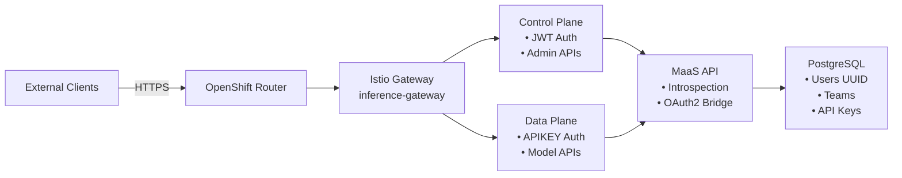
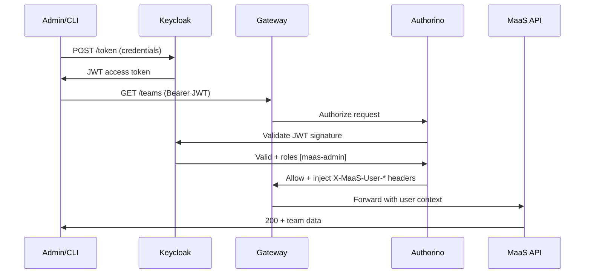
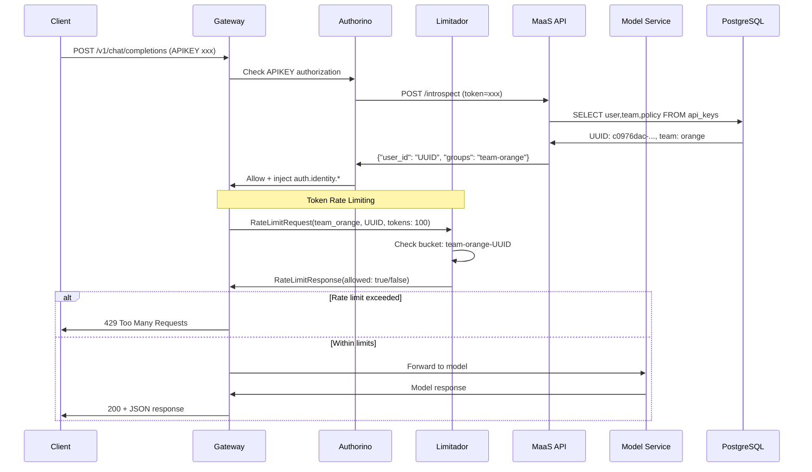
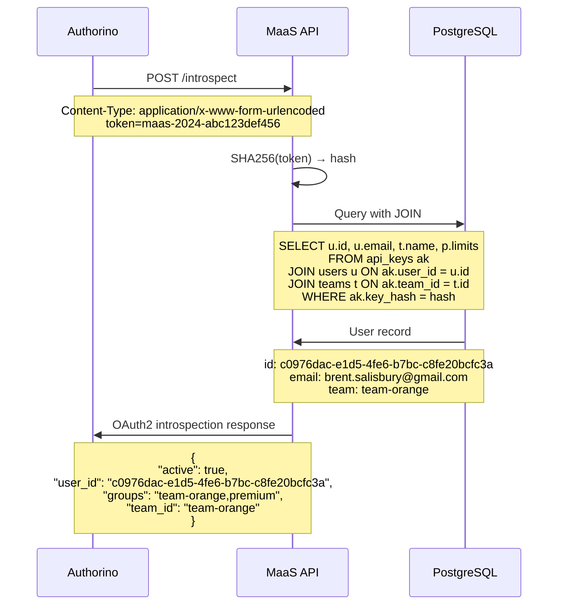
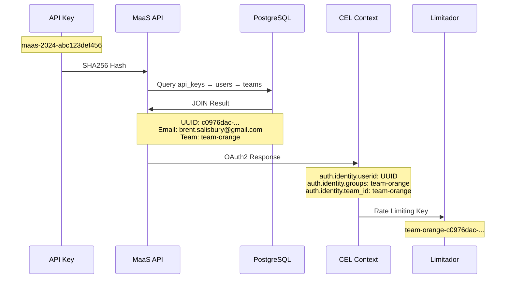
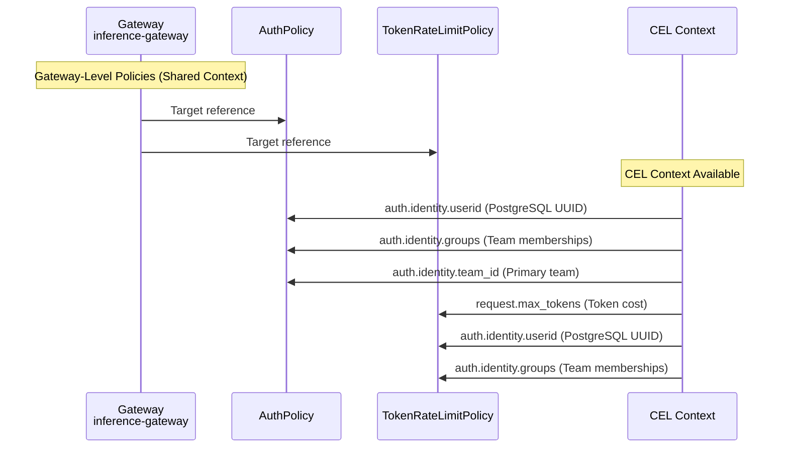
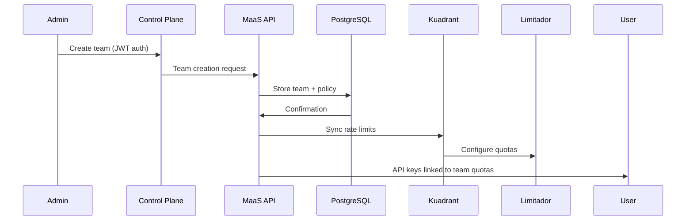
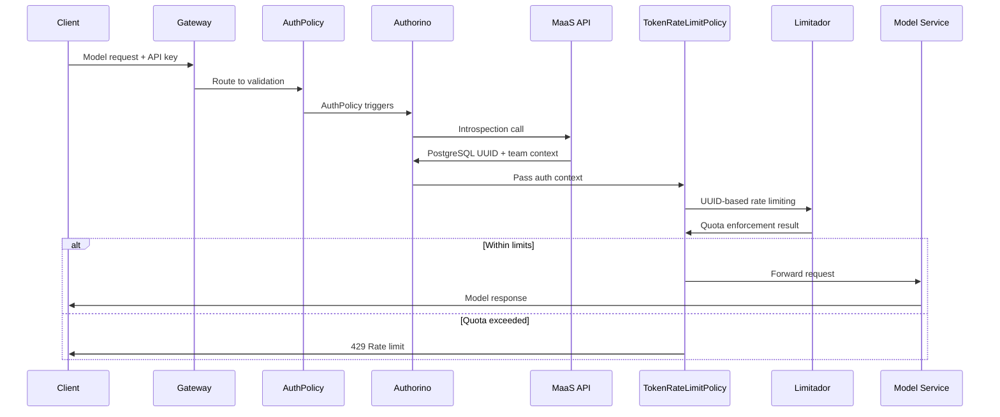

# MaaS Introspection Architecture

## AuthPolicy Summary

Two AuthPolicies manage authentication:
- **maas-control-plane** (`deploy/manifests/13-control-plane-auth-policy.yaml`) - JWT auth for admin/management
- **data-plane-auth-gateway** (`deploy/manifests/data-plane-introspect.yaml`) - API key auth for model inference

## Data Plane Call Workflow (Model Endpoint + API Key)

**Request**: `POST /v1/chat/completions` with `Authorization: APIKEY $API_KEY`

1. Client sends request to `inference-gateway` with `Authorization: APIKEY Zyt5JAfbzyLm_Uwa9OzPLhXObK9mZwCqYXeyHNDQUnw`
2. Gateway triggers `data-plane-auth-gateway` AuthPolicy
3. AuthPolicy calls `POST /introspect` with `token=Zyt5JAfbzyLm_Uwa9OzPLhXObK9mZwCqYXeyHNDQUnw`
4. Introspect extracts key prefix (`Zyt5JAfb`) from first 8 characters
5. Database lookup: `SELECT * FROM api_keys WHERE key_prefix = 'Zyt5JAfb'`
6. Verify full key against stored `key_hash` + `salt`
7. Query team details: `SELECT * FROM teams WHERE id = <team_uuid>`
8. Query user model access: `GetUserModelsAllowed(user_id, team_id)`
9. Return OAuth2 response: `{active: true, user_id: "uuid", team_id: "team-orange", groups: "team-orange"}`
10. AuthPolicy injects `auth.identity.*` context into request
11. Rate limiter checks quota using `auth.identity.userid` + team
12. If within limits: forward to model service, else return 429

## Control Plane Call Workflow (Admin/Management Endpoints)

**Request**: `GET /teams` with `Authorization: Bearer <JWT>`

1. Client sends request to `maas-api-control-plane-route` HTTPRoute
2. HTTPRoute triggers `maas-control-plane` AuthPolicy
3. AuthPolicy validates JWT signature against Keycloak issuer
4. Extract user claims (roles, groups, email) from JWT
5. Check authorization rules:
   - Admin endpoints (`/admin/*`): require `maas-admin` role
   - User endpoints (`/teams`, `/keys`, etc.): require `maas-user` role OR group membership
6. Inject headers: `X-MaaS-User-ID`, `X-MaaS-User-Email`, `X-MaaS-User-Roles`
7. Forward request to MaaS API with user context
8. API returns team/user data based on authorized scope

---

## Architecture Overview



## Core Components

### Control Plane
- **Authentication**: JWT Bearer tokens from Keycloak OIDC
- **Endpoints**: `/teams`, `/users`, `/policies`, `/keys`
- **Purpose**: Administrative operations, user/team management

### Data Plane
- **Authentication**: API key tokens via OAuth2 introspection
- **Endpoints**: `/v1/chat/completions`, `/v1/models`
- **Purpose**: Model inference with rate limiting

### Introspection Service
- **Endpoint**: `/introspect` (internal cluster access)
- **Protocol**: OAuth2 introspection standard
- **Function**: API key → user identity transformation

## Authentication Flows

### Control Plane JWT Flow



### Data Plane APIKEY + Rate Limiting Flow



### Introspection Detail Flow



## User Identity Architecture

### Database Schema
```sql
users:
├── id: uuid (primary key) → c0976dac-e1d5-4fe6-b7bc-c8fe20bcfc3a
├── email: citext → brent.salisbury@gmail.com
├── keycloak_user_id: text → 6ae65b39-6b35-49ee-be74-d2f3b2f2a08b
└── display_name: text

api_keys:
├── key_hash: text (SHA256)
├── user_id: uuid → foreign key to users.id
├── team_id: uuid
└── active: boolean
```

### Identity Resolution Chain



## Rate Limiting Integration

### CEL Expression Policy
```yaml
TokenRateLimitPolicy:
  limits:
    team-orange:
      rates:
        - limit: 100000
          window: "1h"
      when:
        - predicate: auth.identity.groups.split(",").exists(g, g == "team-orange")
      counters:
        - expression: auth.identity.userid  # PostgreSQL UUID
```

### Limitador Request Structure
```rust
RateLimitRequest {
    domain: "maas-db/vllm-simulator-db",
    descriptors: [
        RateLimitDescriptor {
            entries: [
                Entry { key: "tokenlimit.team_orange__cd755ac6", value: "1" },
                Entry { key: "auth.identity.userid", value: "c0976dac-e1d5-4fe6-b7bc-c8fe20bcfc3a" }
            ],
            limit: Some(TokenBucket { max: 100000, window: 3600s })
        }
    ],
    hits_addend: 100  // From request.max_tokens
}
```

## Policy Architecture

### Kuadrant CEL Binding Scope



### Critical Design Rule
**Policies must target the same resource level to share CEL binding context**

- ✅ Both target `Gateway` → Shared context
- ❌ AuthPolicy targets `HTTPRoute`, TokenRateLimitPolicy targets `Gateway` → Separate contexts

## Security Model

### Authentication Boundaries
- **External Access**: TLS termination at OpenShift Router
- **Control Plane**: JWT validation against Keycloak
- **Data Plane**: API key validation via introspection
- **Internal Services**: mTLS service mesh

### Privacy Design
- **Rate Limiting Logs**: PostgreSQL UUIDs (not email addresses)
- **API Key Storage**: SHA256 hashes in database
- **Audit Trail**: UUID-based correlation
- **User Resolution**: Database lookup required for human-readable info

### Network Security
- **Introspection Endpoint**: Internal cluster access only
- **Bypass Gateway**: Authorino → MaaS-API via service mesh
- **No External Auth**: `/introspect` not exposed to internet
- **Service-to-Service**: mTLS encryption

## Data Flow Summary

### User Onboarding



### Request Processing



---

This architecture provides secure API key management with database-backed user identity and OAuth2 introspection for seamless integration with existing Kuadrant policy frameworks.