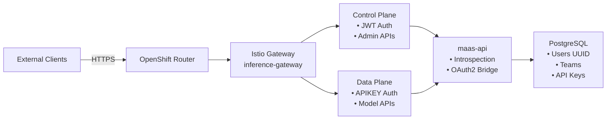
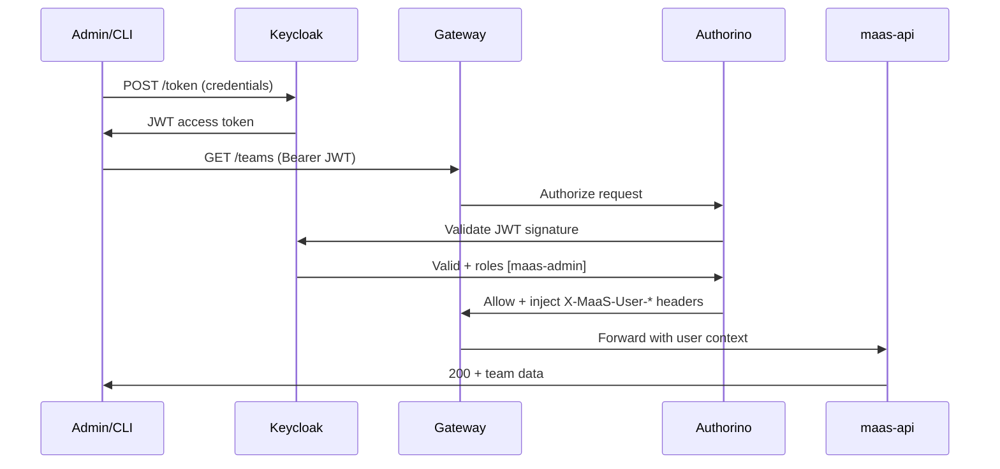
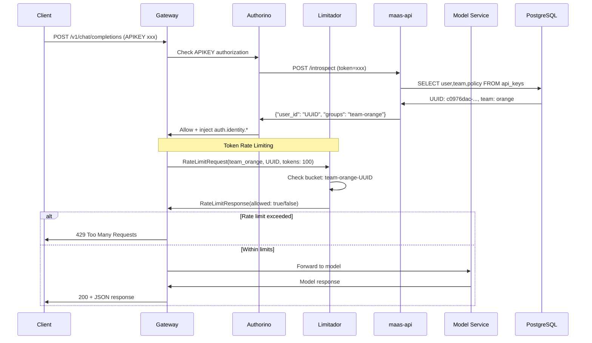
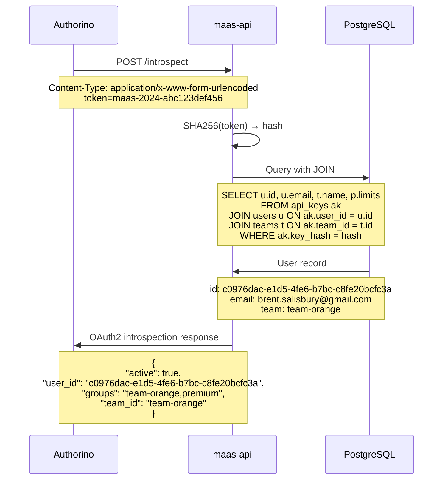
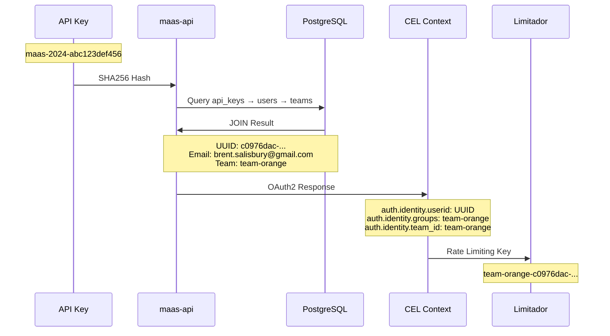
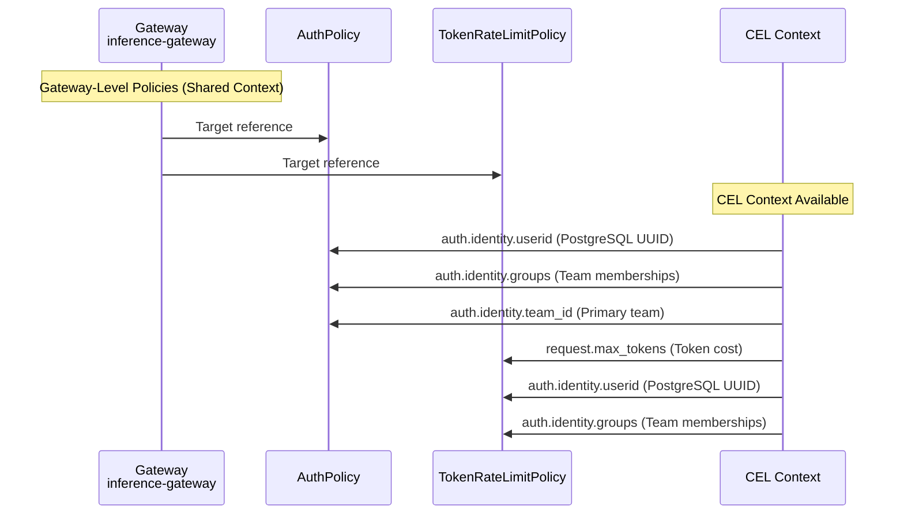
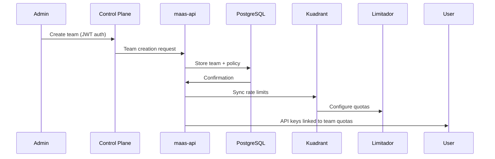
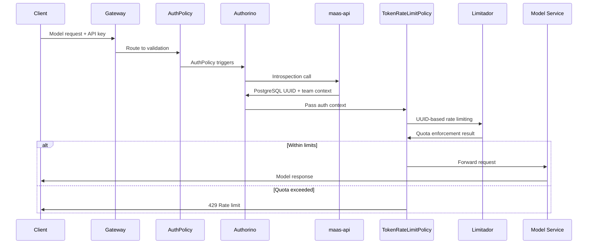

# MaaS OAuth2 Introspection and Group/User Management

## Overview

- Dual Authentication Architecture: Control plane uses JWT/OIDC for admin operations, data plane uses API key introspection for model inference with OAuth2 compliance. In the demo it uses a GItHub OAuth IDP backing via Keycloak.

- Database-Backed Identity Resolution: API keys are hashed and stored in PostgreSQL, linking to user UUIDs/ID/Email and team memberships for privacy-preserving rate limiting

- OAuth Introspection Bridge: maas-api provides /introspect endpoint that transforms API keys into structured identity context (PostgreSQL UUID/IDs + team groups) for Kuadrant policy

## Quickstart

This section provides a quick way to get a JWT and interact with the control and data planes.

```bash
export CONTROL_BASE="http://key-manager.db.apps.maas2.octo-emerging.redhataicoe.com"
export DATA_BASE="http://deepseek-r1.apps.maas2.octo-emerging.redhataicoe.com"
export DATA_BASE="http://simulator.db.apps.maas2.octo-emerging.redhataicoe.com"

# 1) Device flow to get a JWT
DEV=$(curl -k -s -X POST -H "Content-Type: application/x-www-form-urlencoded" \
  -d "client_id=maas-client" -d "client_secret=maas-client-secret" \
  https://keycloak.apps.maas2.octo-emerging.redhataicoe.com/realms/maas/protocol/openid-connect/auth/device)
echo "$DEV" | jq -r .verification_uri_complete
DEVICE_CODE=$(echo "$DEV" | jq -r .device_code)

# Wait for user to authenticate in the browser before running the next command
echo "Press enter after you have authenticated in the browser"
read

USER_JWT=$(curl -k -s -X POST -H "Content-Type: application/x-www-form-urlencoded" \
  -d "grant_type=urn:ietf:params:oauth:grant-type:device_code" \
  -d "device_code=$DEVICE_CODE" -d "client_id=maas-client" -d "client_secret=maas-client-secret" \
  https://keycloak.apps.maas2.octo-emerging.redhataicoe.com/realms/maas/protocol/openid-connect/token | jq -r .access_token)

# 2) Bootstrap account (creates user if needed)
curl -sS -H "Authorization: Bearer $USER_JWT" "$CONTROL_BASE/profile" | jq .

# 3) Create an API key (no UUIDs needed)
KEY_JSON=$(curl -sS -X POST "$CONTROL_BASE/users/me/keys" \
  -H "Authorization: Bearer $USER_JWT" -H "Content-Type: application/json" \
  -d '{"alias":"demo-key"}')
API_KEY=$(echo "$KEY_JSON" | jq -r .api_key)
echo "API Key: $API_KEY"

# 4) List your keys
curl -sS -H "Authorization: Bearer $USER_JWT" "$CONTROL_BASE/users/me/keys" | jq .

# 5) Call data plane with your key
curl -sS "$DATA_BASE/v1/chat/completions" \
  -H "Authorization: APIKEY $API_KEY" \
  -H "Content-Type: application/json" \
  -d '{"model":"simulator-model","messages":[{"role":"user","content":"hello"}],"max_tokens":32}' | jq .
```

## Workflow: Creating Teams with Embedded Rate Limits

This workflow details the simplified process: creating a team with embedded rate limits, automatically syncing to Kuadrant, and generating API keys that inherit the rate limits.

### 1. Create a Team with Rate Limits (with Automatic Kuadrant Sync)

Create a team with embedded rate limits. The rate limits will be automatically validated and synced to the Kuadrant TokenRateLimitPolicy resource.

Send a `POST` request to the `/teams` endpoint:

```bash
# A user JWT is required for this operation (ensure USER_JWT is set from the Quickstart)
TEAM_ID=$(curl -sS -X POST "$CONTROL_BASE/teams" \
  -H "Authorization: Bearer $USER_JWT" -H "Content-Type: application/json" \
  -d '{
    "ext_id": "team-blue",
    "name": "Blue Team",
    "description": "The blue team with 100 requests per minute",
    "rate_limit": 90,
    "rate_window": "1m"
  }' | jq -r .id)

echo "Team ID: $TEAM_ID"


# A user JWT is required for this operation (ensure USER_JWT is set from the Quickstart)
TEAM_ID=$(curl -sS -X POST "$CONTROL_BASE/teams" \
  -H "Authorization: Bearer $USER_JWT" -H "Content-Type: application/json" \
  -d '{
    "ext_id": "team-orange",
    "name": "Orange Team",
    "description": "The orange team with 10000 requests per minute",
    "rate_limit": 10000,
    "rate_window": "5m"
  }' | jq -r .id)

echo "Team ID: $TEAM_ID"
```

**What happens automatically:**
- Rate limit spec is validated (limit must be positive integer, window must match format like "1m", "1h", "24h")
- Team is stored in the database with embedded rate limits
- Rate limits are automatically synced to the Kuadrant TokenRateLimitPolicy with a new limit block:
  ```yaml
  limits:
    team-blue:
      rates:
      - limit: 100
        window: 1m
      when:
      - predicate: auth.identity.groups.split(",").exists(g, g == "team-blue")
      counters:
      - expression: auth.identity.userid
  ```

**Verify the sync:**
```bash
kubectl get tokenratelimitpolicy -n maas-db -o yaml | grep -A 10 "team-blue"
```

### 2. Create API Key with Team Rate Limit Inheritance

Create an API key that automatically inherits the team's rate limiting configuration. The key will be associated with the team and its embedded rate limits.

#### a. User Registration (Automatic)

A user is automatically created in the database the first time they access the `/profile` endpoint with a valid JWT.

```bash
# Bootstrap the user account (creates user record if it doesn't exist)
curl -sS -H "Authorization: Bearer $USER_JWT" "$CONTROL_BASE/profile" | jq .
```

#### b. Create API Key for Team

Create an API key that will inherit the team's rate limits. You can specify the team explicitly or let it use the user's default team.

```bash
# Create API key with explicit team assignment
API_KEY_JSON=$(curl -sS -X POST "$CONTROL_BASE/users/me/keys" \
  -H "Authorization: Bearer $USER_JWT" -H "Content-Type: application/json" \
  -d '{
    "alias": "blue-team-key7",
    "team_id": "'"$TEAM_ID"'"
  }')

API_KEY=$(echo "$API_KEY_JSON" | jq -r .api_key)
echo "API Key: $API_KEY"
export API_KEY=$API_KEY


# Create API key with explicit team assignment
API_KEY_JSON=$(curl -sS -X POST "$CONTROL_BASE/users/me/keys" \
  -H "Authorization: Bearer $USER_JWT" -H "Content-Type: application/json" \
  -d '{
    "alias": "orange-team-key1",
    "team_id": "'"$TEAM_ID"'"
  }')

API_KEY=$(echo "$API_KEY_JSON" | jq -r .api_key)
echo "API Key: $API_KEY"
export API_KEY=$API_KEY
```

kubectl logs -n kuadrant-system deployment/limitador-limitador | grep tokenlimit.team_blue

Test Curl:

```shell
export API_KEY=dVSnNTYEnvoJ9j1M2ZOJDQGwP5aN8FvJQEkNrE8j8g8

curl -sS "$DATA_BASE/v1/chat/completions" \
-H "Authorization: APIKEY $API_KEY" \
-H "Content-Type: application/json" \
-d '{"model":"simulator-model","messages":[{"role":"user","content":"hello"}],"max_tokens":32}' | jq

for i in {1..10}; do printf "Request #%-2s -> " "$i"; \
  curl -s -o /dev/null -w "%{http_code}\n" \
    -H "Authorization: APIKEY $API_KEY" \
    -H 'Content-Type: application/json' \
    -d '{"model":"deepseek-r1","messages":[{"role":"user","content":"Test"}],"max_tokens":10}' \
     $DATA_BASE/v1/chat/completions; done
```


**What happens automatically:**
- The key is created and associated with the specified team
- The key inherits the team's embedded rate limits (100 requests/minute)
- During introspection, the key will return `group: "team-blue"`
- This group matches the TokenRateLimitPolicy predicate for 100 requests/minute limit

## Managing Teams and Keys

### Listing Resources

#### List Teams

To see all teams, send a `GET` request to the `/teams` endpoint.

```bash
curl -sS -H "Authorization: Bearer $USER_JWT" "$CONTROL_BASE/teams" | jq .
```

#### List Team Members (Users)

To list the users (members) of a specific team, send a `GET` request to the `/teams/{team_id}/members` endpoint.

```bash
TEAM_ID="the-id-of-the-team"
curl -sS -H "Authorization: Bearer $USER_JWT" "$CONTROL_BASE/teams/$TEAM_ID/members" | jq .
```

#### List Team Keys

To list the API keys associated with a specific team, send a `GET` request to the `/teams/{team_id}/keys` endpoint.

```bash
TEAM_ID="the-id-of-the-team"
curl -sS -H "Authorization: Bearer $USER_JWT" "$CONTROL_BASE/teams/$TEAM_ID/keys" | jq .
```

#### List User Keys

To list your own API keys, send a `GET` request to the `/users/me/keys` endpoint.

```bash
curl -sS -H "Authorization: Bearer $USER_JWT" "$CONTROL_BASE/users/me/keys" | jq .
```

### Deleting Resources

#### Delete a Team (with Cascading Deletes)

To delete a team, send a `DELETE` request to the `/teams/{team_id}` endpoint. This performs cascading deletes of all dependent resources.

```bash
TEAM_ID="team-blue"
RESULT=$(curl -sS -X DELETE -H "Authorization: Bearer $USER_JWT" "$CONTROL_BASE/teams/$TEAM_ID")
echo "$RESULT" | jq .
```

**What happens automatically:**
- **Database Cascades**: All dependent records are automatically deleted via foreign key constraints:
  - `team_memberships` (ON DELETE CASCADE)
  - `model_grants` (ON DELETE CASCADE)
  - `api_keys` (ON DELETE CASCADE)
  - `usage_metrics` (ON DELETE SET NULL)
- **Kuadrant Cleanup**: The team's rate limits are removed from TokenRateLimitPolicy and AuthPolicy
- **Transactional**: All operations occur within a database transaction for consistency
- **Key Count**: Returns the number of API keys that were cascaded

**Response format:**
```json
{
  "message": "Team deleted successfully",
  "team_id": "uuid",
  "ext_id": "team_external_id",
  "name": "Team Name",
  "cascaded_key_count": 3,
  "deleted_by": "user_id"
}
```

#### Delete an API Key

To delete an API key, send a `DELETE` request to the `/keys/{key_prefix}` endpoint using the first 8 characters of the key.

```bash
KEY_PREFIX="the-first-8-chars-of-your-key"
RESULT=$(curl -sS -X DELETE -H "Authorization: Bearer $USER_JWT" "$CONTROL_BASE/keys/$KEY_PREFIX")
echo "$RESULT" | jq .
```


### Updating Resources

#### Update a Team's Rate Limits

You can update a team's name, description, and rate limits by sending a `PATCH` request to the `/teams/{team_id}` endpoint.

```bash
TEAM_ID="the-id-of-the-team-to-update"

curl -sS -X PATCH "$CONTROL_BASE/teams/$TEAM_ID" \
  -H "Authorization: Bearer $USER_JWT" -H "Content-Type: application/json" \
  -d '{
    "name": "Updated Blue Team",
    "description": "Updated description",
    "rate_limit": 800,
    "rate_window": "1m"
  }'
```

**What happens automatically:**
- Team rate limits are updated in the database
- Changes are automatically synced to the Kuadrant TokenRateLimitPolicy
- All existing API keys for this team immediately inherit the new rate limits


## Complete Workflow Verification

### Test the End-to-End Rate Limiting Flow

Verify that team rate limits correctly flow from creation to rate limiting enforcement:

#### 1. Test Rate Limit Inheritance via Introspection

```bash
# Test API key introspection to verify rate limit inheritance
curl -sS -X POST "$CONTROL_BASE/introspect" \
  -H "Content-Type: application/x-www-form-urlencoded" \
  -d "token=$API_KEY" | jq .
```

Expected response should show:
```json
{
  "active": true,
  "group": "team-blue",
  "team_id": "team-uuid",
  "user_id": "user-uuid",
  "plan": "team-blue"
}
```

#### 2. Test Data Plane Rate Limiting

```bash
# Test data plane access with the API key
curl -sS "$DATA_BASE/v1/chat/completions" \
  -H "Authorization: APIKEY $API_KEY" \
  -H "Content-Type: application/json" \
  -d '{
    "model": "simulator-model",
    "messages": [{"role": "user", "content": "test"}],
    "max_tokens": 10
  }' | jq .
```

#### 3. Verify TokenRateLimitPolicy Configuration

```bash
# Check that your team exists in the TokenRateLimitPolicy
kubectl get tokenratelimitpolicy -n maas-db -o yaml

# Look for your team name in the limits section:
# limits:
#   team-blue:
#     rates:
#     - limit: 100
#       window: 1m
#     when:
#     - predicate: auth.identity.groups.split(",").exists(g, g == "team-blue")
```

#### 4. Test Rate Limiting Enforcement

To test rate limiting is working, make rapid requests (exceeding 100 in 1 minute):

```bash
# Run rapid requests to test rate limiting
for i in {1..105}; do
  curl -sS "$DATA_BASE/v1/chat/completions" \
    -H "Authorization: APIKEY $API_KEY" \
    -H "Content-Type: application/json" \
    -d '{"model": "simulator-model", "messages": [{"role": "user", "content": "test"}], "max_tokens": 1}' &
done
wait
```

You should see rate limiting kick in after 100 requests.


### Automated Testing

Use the provided test script to verify the complete workflow:

```bash
# Set environment variables
export USER_JWT="your-jwt-token"
export CONTROL_BASE="http://maas-api.db.apps.maas2.octo-emerging.redhataicoe.com"
export DATA_BASE="http://simulator.db.apps.maas2.octo-emerging.redhataicoe.com"

# Run complete workflow test (if available)
./test-complete-workflow.sh
```

## Architecture Summary

The simplified team-based rate limiting workflow implements the following data flow:

```
Team Creation with Rate Limits (API)
    ↓ [validates rate_limit and rate_window]
Database Storage (teams table)
    ↓ [auto-sync via PolicyManager]
TokenRateLimitPolicy (Kuadrant)
    ↓ [key creation inherits team rate limits]
API Key Generation
    ↓ [introspection returns team-name]
Rate Limiting Enforcement
```

**Key Implementation Points:**
- Teams have embedded rate limits (rate_limit, rate_window, rate_limit_spec)
- PolicyManager automatically syncs team rate limits to TokenRateLimitPolicy
- API keys inherit team rate limits via introspection group formatting
- TokenRateLimitPolicy predicates match "{team-name}" groups
- No separate policy entities - everything is team-centric
- Rate limit updates to teams automatically propagate to all team keys

**Benefits of the New Architecture:**
- **Simplified**: No separate policy management - rate limits are embedded in teams
- **Consistent**: Team names directly match rate limiting identifiers (no name mismatches)
- **Automatic**: Rate limit changes to teams immediately affect all team keys
- **Intuitive**: Team-centric model is easier to understand and manage


# MaaS Introspection Architecture

## Architecture Overview



## Core Components

### Control Plane
- **Authentication**: JWT Bearer tokens from Keycloak OIDC
- **Endpoints**: `/teams`, `/users`, `/policies`, `/keys`
- **Purpose**: Administrative operations, user/team management

### Data Plane
- **Authentication**: API key tokens via OAuth2 introspection
- **Endpoints**: `/v1/chat/completions`, `/v1/models`
- **Purpose**: Model inference with rate limiting

### Introspection Service
- **Endpoint**: `/introspect` (internal cluster access)
- **Protocol**: OAuth2 introspection standard
- **Function**: API key → user identity transformation

## Authentication Flows

### Control Plane JWT Flow



### Data Plane APIKEY + Rate Limiting Flow



### Introspection Detail Flow



## User Identity Architecture

### Database Schema
```sql
users:
├── id: uuid (primary key) → c0976dac-e1d5-4fe6-b7bc-c8fe20bcfc3a
├── email: citext → brent.salisbury@gmail.com
├── keycloak_user_id: text → 6ae65b39-6b35-49ee-be74-d2f3b2f2a08b
└── display_name: text

api_keys:
├── key_hash: text (SHA256)
├── user_id: uuid → foreign key to users.id
├── team_id: uuid
└── active: boolean
```

### Identity Resolution Chain



## Rate Limiting Integration

### CEL Expression Policy
```yaml
TokenRateLimitPolicy:
  limits:
    team-orange:
      rates:
        - limit: 100000
          window: "1h"
      when:
        - predicate: auth.identity.groups.split(",").exists(g, g == "team-orange")
      counters:
        - expression: auth.identity.userid  # PostgreSQL UUID
```

### Limitador Request Structure
```rust
RateLimitRequest {
    domain: "maas-db/vllm-simulator-db",
    descriptors: [
        RateLimitDescriptor {
            entries: [
                Entry { key: "tokenlimit.team_orange__cd755ac6", value: "1" },
                Entry { key: "auth.identity.userid", value: "c0976dac-e1d5-4fe6-b7bc-c8fe20bcfc3a" }
            ],
            limit: Some(TokenBucket { max: 100000, window: 3600s })
        }
    ],
    hits_addend: 100  // From request.max_tokens
}
```

## Policy Architecture

### Kuadrant CEL Binding Scope



### Critical Design Rule
**Policies must target the same resource level to share CEL binding context**

- ✅ Both target `Gateway` → Shared context
- ❌ AuthPolicy targets `HTTPRoute`, TokenRateLimitPolicy targets `Gateway` → Separate contexts

## Security Model

### Authentication Boundaries
- **External Access**: TLS termination at OpenShift Router
- **Control Plane**: JWT validation against Keycloak
- **Data Plane**: API key validation via introspection
- **Internal Services**: mTLS service mesh

### Privacy Design
- **Rate Limiting Logs**: PostgreSQL UUIDs (not email addresses)
- **API Key Storage**: SHA256 hashes in database
- **Audit Trail**: UUID-based correlation
- **User Resolution**: Database lookup required for human-readable info

### Network Security
- **Introspection Endpoint**: Internal cluster access only
- **Bypass Gateway**: Authorino → Key-Manager via service mesh
- **No External Auth**: `/introspect` not exposed to internet
- **Service-to-Service**: mTLS encryption

## Data Flow Summary

### User Onboarding



### Request Processing




This architecture provides secure API key management with database-backed user identity and OAuth2 introspection for  integration with existing Kuadrant policy frameworks.

